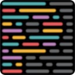
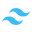

### 👋 Fala pessoal! My name is André

- I fell in love with programming when I solved my first challenge using javascript.
- Since then I became enthusiastic about its amazing tools.
- I'm studying about web development.
- But I don't intend to stop there.

### 🎓 My programming tools, so far

---

"We are what we do repeatedly. Excellence, therefore, is not an act but a habit." **Aristotle**. 🏛️

---

  

  
 

